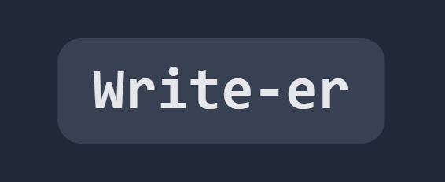
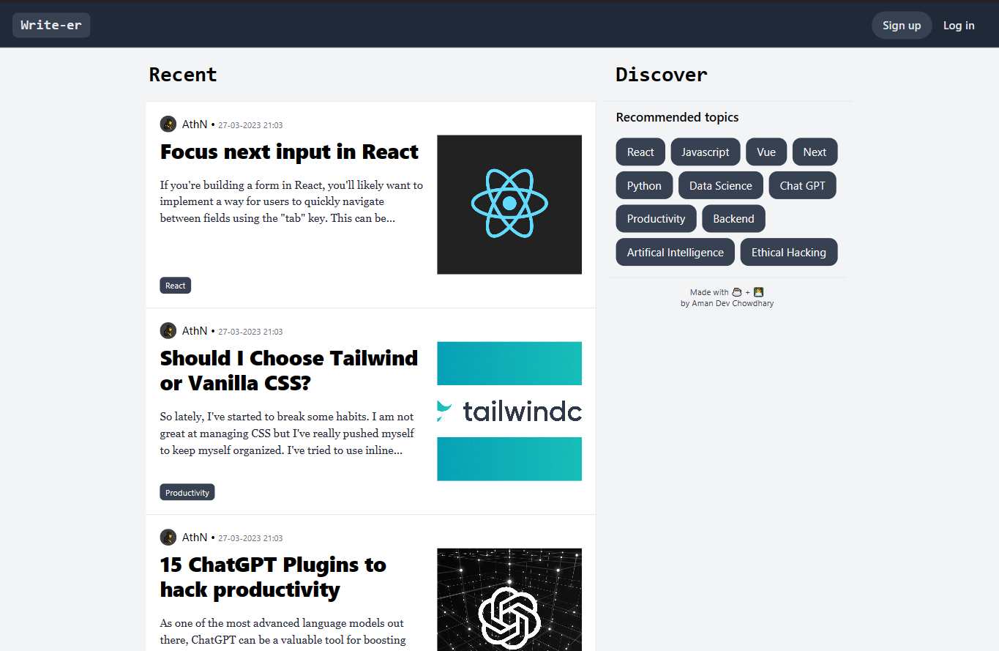
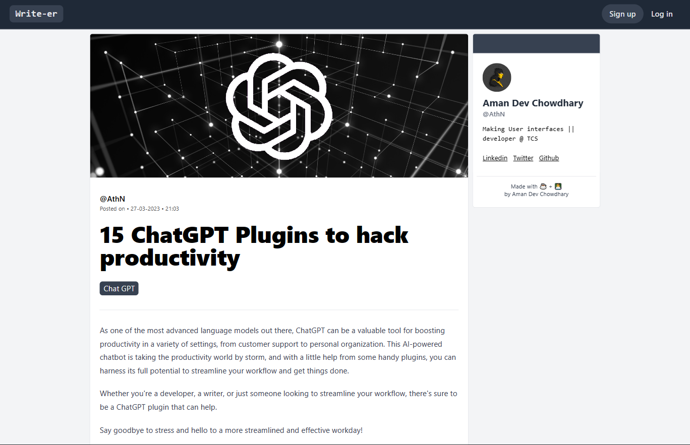

<p align="center">
   
</p>
<h1 align="center">write-er ✍</h1>
<h3 align="center">A simple blogging application.
</h3>

<p align="center">
    
    
    
    
    
    
    
    
</p>
<p align="center">
  <a href="#about-the-project">About The Project</a> •
  <a href="#local-setup">Local Setup</a>
  
</p>

<p align="center">
   
</p>
<p align="center">
   
</p>

## About The Project

Heiwa is a messaging platform for people to talk about their mental health and connect with people going through a similar phase.
It also has a basic whiteboard which can be used to play funny doodle games, or people can use it to express themselves creatively.
<br><br>On the homepage, The user has to fill the following details :

1. Nickname
2. Tags to describe your feeling
3. Tags to describe your interests

The user is matched randomly to another user. After matching, the users can talk about their mental health problems through chat box, or can use the whiteboard to play simple games like (Tic-tac-toe, hangman etc).

## Local Setup

To clone and run this application, you'll need [Git](https://git-scm.com) and [Node.js](https://nodejs.org/en/download/) (which comes with [npm](http://npmjs.com)) installed on your computer. From your command line:

```bash
# Clone this repository
$ git clone https://github.com/AthN3090/write-er-app.git
# Go into the repository
$ cd write-er-app

# Install dependencies
$ npm install

# Run the app
$ npm run dev
```

---

### Backend API

The API is written in Express. It handles all the CRUD requests, User authentication requests with JSON webtoken and deals with AWS s3 to store images.<br>
Link - [Backend code repo - Express + Node](https://github.com/AthN3090/write-er-api)
